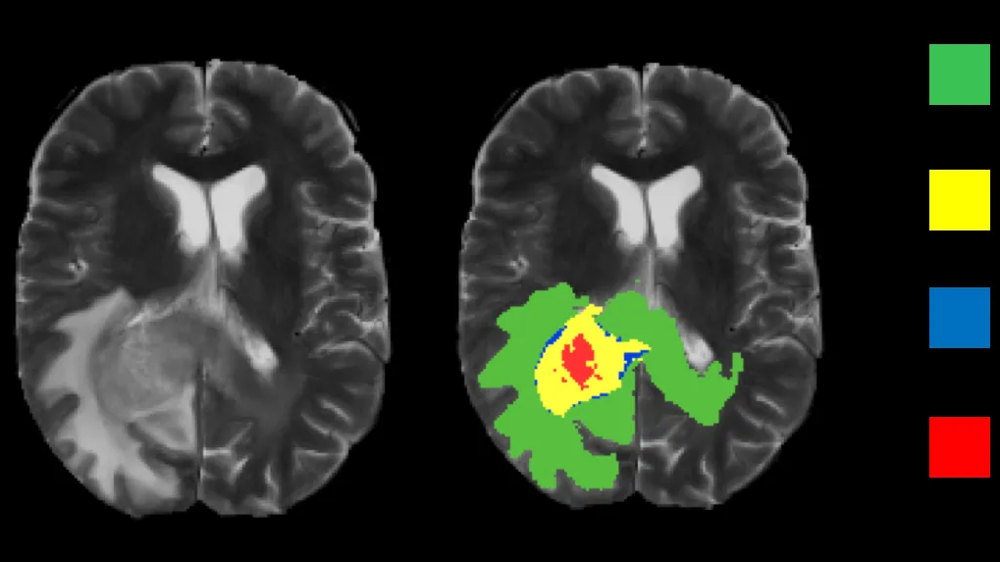
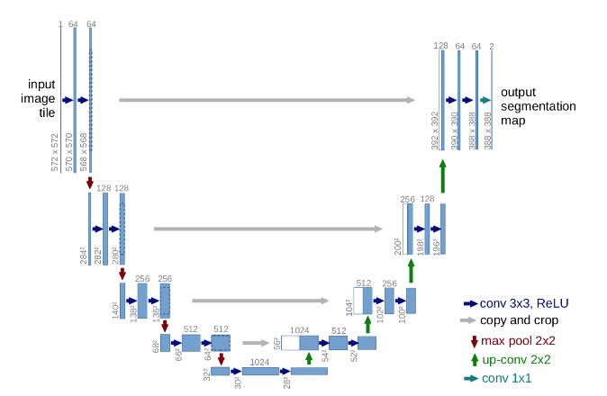
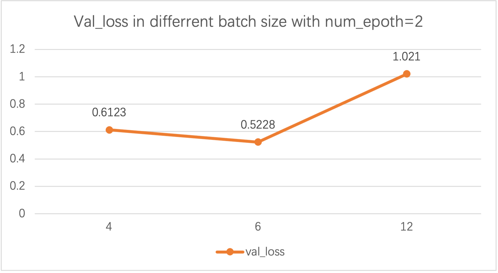
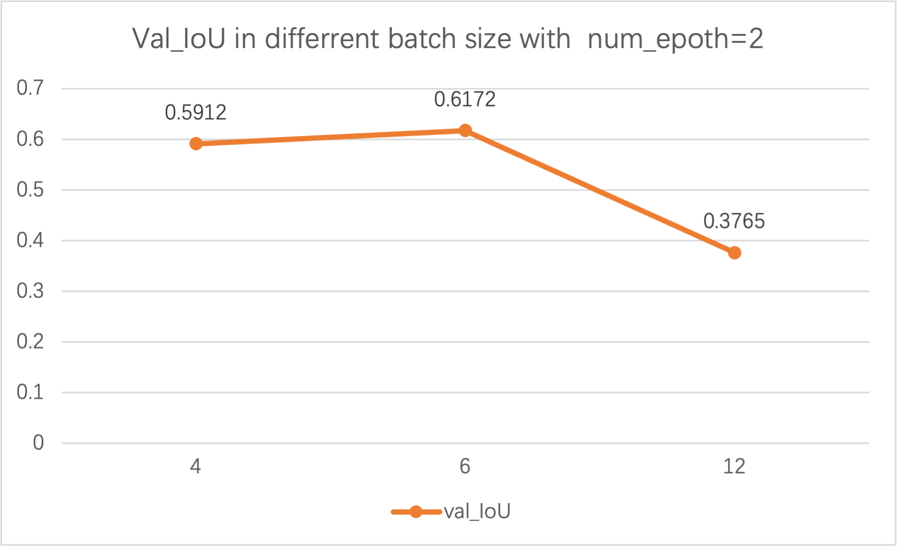
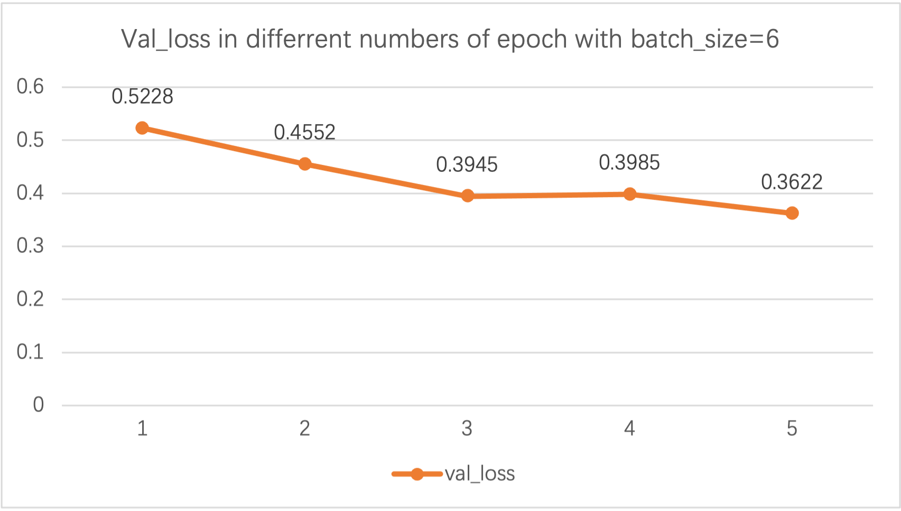
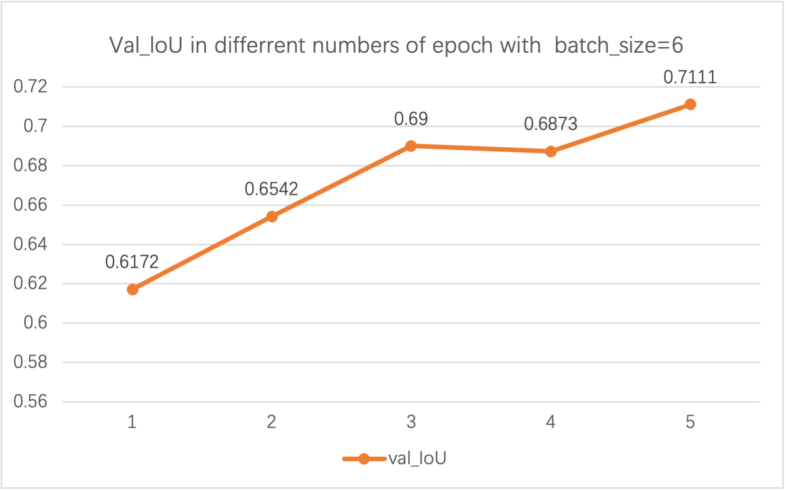

# CNN-based Brain Tumour Segmentation Network

Final Project - Data Science Summer School 2021 @Imperial College London

## Table of Contents

- [Abstract](#Abstract)
- [Introduction](#Introduction)
- [Methodology](#Methodology)
- [Results and Analysis](#results-and-analysis)
- [Discussion](#Discussion)
- [Conclusion](#Conclusion)

## Abstract

Tumors are known to pose a major threat to health, especially in the brain. Brain tumor is one of the leading causes of cancer death. Accurate segmentation and quantitative analysis of brain tumors are critical for diagnosis and treatment planning. Our project focuses on designing a deep neural network to complete brain tumor image segmentation in MR brain images. To complete the final task of segmentation of brain tumors, we completed the following work. The experimental data for this project is more than 7000 MR images, so we need to divide the data set into a training set and a validation set. Image enhancement was performed on the training set. The second step is to design the U-NET network and construct the segmentation model of brain tumors. The third step is defining the project's loss and evaluation functions. Fourth, train and evaluate the model. At the same time, we designed an algorithm for image display.

**Keywords**: Deep learning; Brain Tumour; Image Segmentation; U-net

## Introduction

As a major part of medical data, medical imaging data is widely used in clinical medicine, among which the common medical data analysis, classification, and segmentation in medical images are often applied in several clinical fields. Before the extensive usage of Deep Learning, or to say before the extensive usage of CNN or DNN, which significantly promoted the application of deep learning in the field of image analysis, traditional machine learning techniques, such as model-based and Atlas-based methods, had been widely used in the field of medical image analysis. However, these methods require significant artificial feature engineering to achieve satisfactory accuracy. In contrast. Deep learning refers to the neural network that combines multiple nonlinear processing layers, abstracts the original data layer by layer, and thus obtains different levels of abstract features from the data. This allows deep learning to replace manual feature acquisition with unsupervised learning and efficient algorithms for layered feature extraction.

Looking back to the history of the CNN network, in 1998, Lecun et al.[1] applied CNN to the field of image recognition for the first time. This network can directly input the original image, avoiding the complex pre-processing steps. In recent years, CNN has been widely used in brain tumor segmentation. Due to the variety of brain tumor types, Malathi M et al.[2] make use of a convolution neural network to segment brain tumors into four classes, edema, non-enhancing tumor, enhancing tumor, and necrotic tumor, to improve the likelihood of successful treatment. However, because the traditional 2D CNN can't extract the different information among different modes with satisfaction, Qiwei Cao et al.[3] proposed a solution based on 3D multi-pooling CNN by implementing multi-scale input and multi-scale down-sampling. Some researchers have also made some progress in data processing to improve the accuracy and robustness of brain tumor segmentation. For example, Dongli Shuai et al.[4] proposed an automatic segmentation algorithm based on CNN and a fuzzy inference network. 

Due to significantly enhanced computing power, some innovations are combinations of CNN and other new methods in the evolution of CNN models. Ragupathy et al.[5] research is an example. CNN achieves classification of brain tumors, and then segmentation is completed by multiple kernel K means clustering (MKKNC). SIFT is a common algorithm for image feature extraction. Qian Wei et al.[6] applied multi-scale CNN to the segmentation of brain tumor images and fused with SIFT features to obtain feature description as the feature of CNN. These methods not only improve efficiency but also accuracy. The brain tumor processing method based on CNN will continue to develop in the direction of combining multiple methods, and the auxiliary diagnosis function will be more accurate and effective.

Except for CNN-based methods, there are some improved methods nowadays. To overcome the difficulties of brain tumor image segmentation, Lei X et al. [7] proposed the Sparse-based Shape image segmentation algorithm; the most important is to establish a base Prior constraint model by the brain tumor image. HU Chu-yan et al. [8]proposed a method based on superpixel and improved U-net mean shift. The first part is the segmentation of the contour region of the brain tumor, and the second part, the improved U-NET algorithm, is used to segment the contour region of the brain tumor image.

However, without a systematic theory to explain neural networks, the medical experts who use those models cannot know exactly why they make those judgments. This led to a crisis of trust among medical experts when using models. Mercifully, at present, more and more research focuses on the "explainability'' and interpretability of DL models, which will help to increase the transparency of DL models and thus could lay the foundation for the applications of deep learning in the field of medical images on a deeper level in the future.

To conclude, the current medical image analysis (medical image segmentation, etc. ) based on the deep learning model cannot be used as a solution to supplant medical experts, but it can help them make decisions. In the future, with the continued pursuit of high precision, the pursuit of interpretability will be paid more and more attention.

## Methodology

This project focuses on designing a deep neural network to complete brain tumor image segmentation in MR brain images. Accurate detection of brain tumors has been a difficult and real-world challenge with important clinical implications. Specifically, we need to divide the data set into training and validation sets. Among them, the training set participates in model training, and the verification set does not participate in model training. Another point to note is that generalization is critical for deep learning models. We need to define the appropriate project loss and evaluation function for the image segmentation project. The most important point is that we must design a deep learning network, and u-NET is more suitable for this experiment.

### General Design

First, the data set is processed, such as segmentation and enhancement. The second step is to design the U-NET network and construct the segmentation model of brain tumors. The third step is defining the project's loss and evaluation functions. Fourth, train and evaluate the model. At the same time, we designed an algorithm for image display.

### Defined Function/Class

#### SplitData

The original images and their segmentation map are randomly shuffled and divided into the train and validation sets and then copied to the/Train/Yes and Val/Yes paths. At the same time, the corresponding IDs list is generated for the DataGenerator class defined below.

#### DataGenerator

We defined the DataGenerator class. Initializing a DataGenerator instance requires an ID list, batch size, data shape(image shape and channels), and shuffle(as a boolean type) as arguments. Its method \_\_getitem\_\_(along with \_\_data\_generation) reads and delivers one batch of the data(shape = [batch\_size, 240, 240, 3]). The data augmentation is also done within the \_\_getitem\_\_method. We use ImageDataGenerator from keras.preprocessing.image to add noises and modify the brightness of the images.

#### Evaluate Function

Next, we defined a metric(iou\_coef) to evaluate the similarity between the predicted and true segmentation map. It is defined as:
$$
\text{iou\_coef(y\_true,y\_pred)} =\frac{\text{intersection area}+\text{smooth}}{\text{union area}+\text{smooth}}
$$
where smooth is a given constant, and in our experiment, smooth is set to 1, y\_true and y\_pred are the segmentation maps of one batch's data. We also define the loss function based on iou\_coef as:
$$
Loss(y_true,y_pred)=-log(iou_coef(y_true,y_pred))
$$
In this way, the loss function will be 0 as iou\_coef reaches 1 and will be $+\infty$ If iou\_coef approaches 0.

Then, we use the classic unit to build our own model.

#### Predicted

After that, the predicted and true segmentation maps are printed using matplolib.pyplot, so that we can visualize the results and verify our outcomes. The accuracy of the training is also shown at this step.

Since the segmentation needs to be a 0-1 map, we use a threshold function to convert the output(possibility) to the desired form.

## Result and Analysis

In this section, we are trying to find out how batch size and number of epochs affect the performance of the trained model. Batch size refers to the number of samples that will be propagated in an iteration(training step), while the number of epochs refers to the number of complete passes through the training dataset.

Other parameters are kept the same to investigate the influence of batch size: the number of epochs is fixed to 2, and the Adam optimizer has a 1e-3 learning rate. Since the usage of GPU, the batch size exceeding 20 will cause OOM(out of memory) problems in the computers used; finally, 3 different batch sizes were chosen to run the experiment, which is 4, 6, and 12.

The above figures show that the loss value of producing the validation database when batch sizey higher than the rest of the two-loss values, which means tha is 12, the loss is significantlt when batch size is 12, we might get a worse prediction model after training. This may be because a large model makes large and small gradient updates. At the same time, it is widely accepted that a batch size that is too large will lead to poor generalization (but definitely, in this experience, batch size means batch size 12 is far from too large). Additionally, the loss value of the loss when patch size = 6 is slightly better than when batch size = 4. Although because of the GPU limit, 4 and 6 are both very small batch sizes compared to what is normally used in DL, we could try to explain when 6 is better because, with a smaller batch size, it is more likely that it is too late to converge while training.

After seeing the loss, it is no surprise to see the accuracy. One thing that should be mentioned here is that the test dataset hasn't been released yet. Thus, we could only see the performance of our model while dealing with the validation dataset, and these values are called "Val_xxx." When batch size = 12, accuracy is much lower, and best accuracy is when batch size = 6.

Next, we will focus on the training process. Batch\_size = 6 is chosen as they have the best performance in the last section, and we try to see the val\_loss and val\_IoU in each epoch. According to the above figures, convergence begins by the third epoch. Before the third epoch, the loss value decreases much more rapidly, but after the third epoch, the loss value begins to fluctuate.

## Discussion

The model we trained indicates a fairish accuracy. But there are still many further improvements we could make. For instance, because we are currently limited by GPU power, larger numbers for both batch size and number of epochs were not tried, but doing those may give us a much better model. Furthermore, since a problem occurs after training the model for different patch sizes and several epochs, and also because of the time limit, we could not find a solution to solve that problem. So, there are other parameters we could adjust. For instance, learning rates and different optimizers could be given a try.

## Conclusion

Our project focuses on writing the code using a U-net neural network to train a model to complete brain tumor image segmentation in MR brain images. In conclusion, because of some limits, our result may not be precise enough, but there should definitely be some part of our self-written code that could be improved further.

## References

1. Lécun Y, Bottou L, Bengio Y, et al. Gradient-based learning applied to document recognition[J]. Proceedings of the IEEE, 1998, 86(11): 2278-2324.
2. Lei X L, Yu X S, Chi J N, Wang Y, Wu C D . 2019. Brain tumor segmentation based on prior sparse shapes. Journal of Image and Graphics, 24(12): 2222-2232. [DOI: 10.11834/jig.190070]
3. Cao Qiwei, Wang Feng, Niu Jin. Brain tumor medical image segmentation optimization based on 3D convolutional neural network [J]. Modern Electronic Technology, 2020, 43(03): 74-77.
4. Shuai Dongli, Li Qiang, Guan Xin. Brain tumor segmentation combined with convolutional neural network and fuzzy system[J]. Computer Science and Exploration, 2018, 12(04): 610-611
5. Ragupathy, B,  Karunakaran, M.  A deep learning model integrating convolution neural network and multiple kernel K means clustering for segmenting brain tumor in magnetic resonance images. Int J Imaging Syst Technol.  2021; 31: 118– 127. https://doi.org/10.1002/ima.22498
6. Wei Qian, Du Junrong, Yao Mengyang, Tang Yanru, Xiao Yanli, Peng Lei. The application of OpenCV and multi-scale CNN in brain tumor image processing. [J] China Science and Technology Investment, 2021, 06:168-169
7. Lei X L, Yu X S, Chi J N, Wang Y, Wu C D . 2019. Brain tumor segmentation based on prior sparse shapes. Journal of Image and Graphics, 24(12): 2222-2232. [DOI: 10.11834/jig.190070]
8. HU Chu-yan, SI Ming-ming,CHEN Wei. Brain MRI Tumor Segmentation Method Based on Superpixel and Mean Shift [J/OL]. Journal of  Chinese Computer Systems:1-9[2021-08-10].

